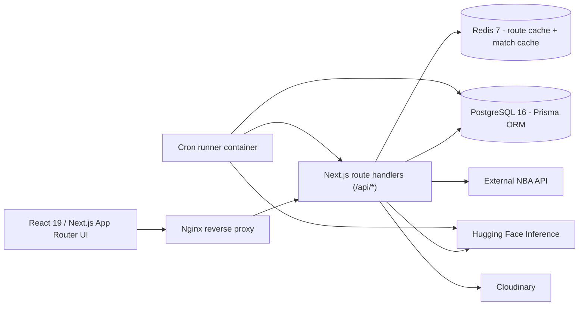
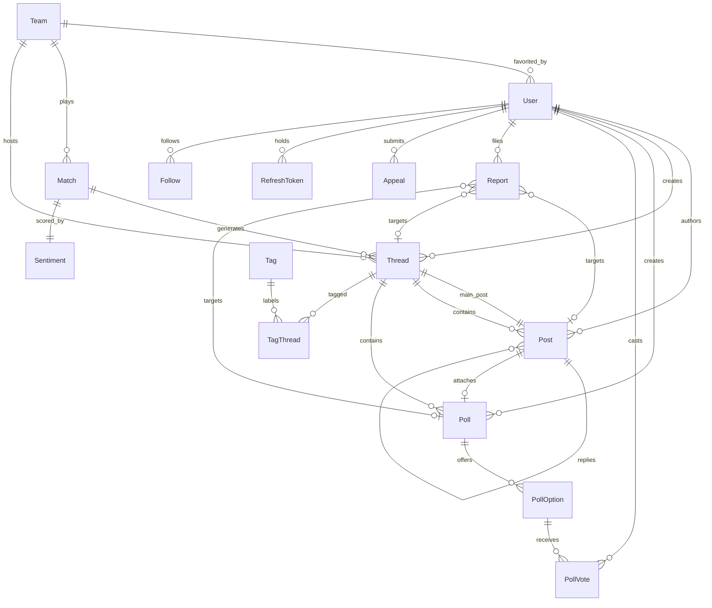

# SportsDeck

A full-stack, basketball-first social platform for NBA fans. SportsDeck ingests live NBA data on a schedule, auto-generates a discussion thread for every match, runs AI moderation/sentiment/translation over user content, and serves it all through a Redis-cached Next.js API and a team-themed React front end.

Live deployment: https://sportsdeck-7do6o7690-trishuls22-2864s-projects.vercel.app/

---

## Table of Contents

- [Tech Stack](#tech-stack)
- [Architecture](#architecture)
- [Feature Overview](#feature-overview)
  - [Authentication & Accounts](#authentication--accounts)
  - [Live NBA Data Ingestion](#live-nba-data-ingestion)
  - [Forums, Threads & Posts](#forums-threads--posts)
  - [Polls](#polls)
  - [AI Pipelines](#ai-pipelines)
  - [Moderation, Reports & Appeals](#moderation-reports--appeals)
  - [Social Graph & Personalized Feed](#social-graph--personalized-feed)
  - [Search & Discovery](#search--discovery)
  - [Theming & UI](#theming--ui)
- [Redis Caching Layer](#redis-caching-layer)
- [Scheduled Jobs](#scheduled-jobs)
- [Data Model](#data-model)
- [API Surface](#api-surface)
- [Project Structure](#project-structure)
- [Getting Started](#getting-started)
- [Docker Deployment](#docker-deployment)
- [Environment Variables](#environment-variables)
- [Testing](#testing)

---

## Tech Stack

| Layer | Technology |
| --- | --- |
| Language | TypeScript, JavaScript (ESM app code, CJS cron scripts) |
| Framework | Next.js 16 (App Router, Route Handlers, Server/Client Components) |
| UI | React 19, Tailwind CSS 4, Framer Motion |
| Runtime | Node.js 20 |
| Database | PostgreSQL 16 (Supabase in production) |
| ORM | Prisma 6 (migrations, generated client, connection pooling) |
| Cache | Redis 7 (`redis` node client, AOF persistence) |
| Auth | NextAuth (Google OAuth, JWT strategy) + custom JWT access/refresh tokens, bcrypt password hashing |
| AI / ML | Hugging Face Inference (`@huggingface/inference` + REST router) |
| Media | Cloudinary (avatar uploads) |
| External Data | NBA data provider via RapidAPI-style headers (`highlightly.net`) |
| Infrastructure | Docker + Docker Compose, Nginx reverse proxy, Vercel |
| Testing | Jest 30, Babel, custom in-memory Prisma mock + HTTP mocks |
| Tooling | ESLint 9 (`eslint-config-next`), PostCSS, OpenAPI 3.0 spec, Postman collection |

## Architecture



Request flow for a cached read: **Redis hit → return**, else **PostgreSQL read → cache → return**, else **external API fetch → upsert into PostgreSQL → cache → return**. If the upstream provider fails, the API degrades gracefully to a `database-fallback` response instead of erroring.

## Feature Overview

### Authentication & Accounts

- **Dual auth paths**: email/password signup and login (bcrypt hashed) plus Google OAuth through NextAuth with a JWT session strategy.
- **Access/refresh token rotation**: short-lived access JWT (2h) and refresh JWT (24h). Refresh tokens are SHA-256 hashed and persisted in a `RefreshToken` table with `expiresAt` / `revokedAt` columns, so logout revokes server-side rather than only clearing a cookie.
- **HttpOnly cookies** with `secure` in production and `sameSite=lax`, plus an `Authorization: Bearer` fallback for API clients.
- Auth resolution is unified in `lib/auth.js`: cookie → bearer header → NextAuth token, so both auth systems work against the same route handlers.
- OAuth users are auto-provisioned with a slugified, collision-free unique username derived from their name or email.
- Profile management: username, favorite team, dark/light theme mode, and avatar upload (multipart `File` → base64 data URI → Cloudinary `avatars/` folder, with MIME and 5 MB size validation).

### Live NBA Data Ingestion

- `/api/matches` accepts `date`, `fromDate`/`toDate`, `stage` (regular/preseason/playoffs), `teamId`, `limit`, and `refresh` filters with full input validation.
- Handles messy upstream payloads: multi-season candidate lookups, period-array score summing, status normalization into `scheduled` / `live` / `finished`, venue resolution, and canonical team-name aliasing (`Cavs` → `Cleveland Cavaliers`, and so on for all 30 franchises).
- Teams are lazily created through a per-request in-memory `teamCache`, and matches are `upsert`ed on a `(homeTeamId, awayTeamId, date)` composite unique key so repeated syncs never duplicate rows.
- **Auto-generated discussion threads**: every persisted match gets a thread titled `"{Away} at {Home} - {tipoff}"` with a system-authored main post, auto-connected team tags, and computed `opensAt` / `closesAt` windows (opens two weeks before tipoff, closes two weeks after the match ends). A self-healing pass recreates threads for any match found without one.
- `/api/standings` and `/api/teams` pull conference/division standings with alias normalization, division→conference inference, record parsing, pagination across upstream pages, and season-year candidate resolution.

### Forums, Threads & Posts

- Thread listing with filtering by `title`, `author`, `team`, and multi-value `tags`; sorting; page/pageSize pagination; and `includeMeta`, `includeTotal`, `lite` response-shaping flags to trim payloads.
- Nested replies via a self-referencing `Post.parentId` relation with cascade deletes.
- **Content versioning**: `Post.version` and `Poll.version` increment on every edit, and prior revisions are persisted as sentinel-tagged history records (`__edit_history__` / `__poll_edit_history__`), exposed through a cursor-paginated version history endpoint.
- Soft visibility (`isVisible`) on posts, threads, and polls so moderators can hide content without destroying reply chains.
- Thread lifecycle controls: `isClosed`, `opensAt`, `closesAt` for scheduled match threads.
- Tagging system backed by a `Tag` / `TagThread` join table with `connectOrCreate` semantics.

### Polls

- Polls attach to either a thread or an individual post, with multiple options, a voting deadline, and one-vote-per-user enforcement.
- Vote tallies, per-viewer vote state (cached per user), poll editing with version history, and poll reporting.

### AI Pipelines

All AI runs through Hugging Face Inference with neutral/non-toxic fallbacks so the app never hard-fails on provider outages or rate limits.

| Capability | Model | Where |
| --- | --- | --- |
| Toxicity moderation | `unitary/toxic-bert` | Post/thread/poll creation, edits, and reports |
| Sentiment analysis | `cardiffnlp/twitter-roberta-base-sentiment-latest` | Thread sentiment endpoint + cron job |
| Language detection | `papluca/xlm-roberta-base-language-detection` | Post translation |
| Translation | `facebook/mbart-large-50-many-to-many-mmt` (55-language code map), falling back to `Helsinki-NLP/opus-mt-mul-en` | Post translation |
| Daily digest summarization | `facebook/bart-large-cnn` | `/api/digest/daily` |

- **Moderation pipeline**: content is classified before it is persisted. The top-scoring label drives routing — a score in `(0.1, 0.5)` publishes the content but auto-files a report for admin review, while a score `>= 0.5` escalates with the detected score recorded in the report reason. Reports store `aiVerdict` and a numeric `toxicity` float for downstream triage.
- **Sentiment**: posts are chunked into batches of 10 and truncated to 512 characters to respect model input limits, then mapped onto a `[-1, 1]` score. Separate prompted passes compute home-team and away-team sentiment alongside the overall score, upserted as one row per match with a `numPosts` sample size.
- **Translation**: detects the source language, maps it to an mBART language code, translates to English, and falls back to a multilingual→English model when the language is unmapped.
- **Daily digest**: aggregates the day's top threads, final scores, and a standings snapshot into a structured prompt, summarizes it, and guards the call with a 15s inference timeout plus an in-flight request map so concurrent requests share one generation. Falls back to a deterministic hand-built digest if the model is slow or unavailable.

### Moderation, Reports & Appeals

- Polymorphic `Report` model targeting posts, threads, or polls, with duplicate-report prevention per user.
- **Admin review queue** (`/api/admin/report/queue`) normalizes AI verdicts into `SAFE` / `WARNING` / `VIOLATION` severity bands (thresholds at 0.5 and 0.8), sorts by severity, parses auto-moderation metadata (attempted content, offender user id, detected score) out of generated reasons, and builds deep links to the offending content. Edit-history sentinel records are filtered out of the queue.
- Admin actions: resolve or dismiss reports, hide content, and ban users (`/api/admin/ban/[userId]`).
- **Appeals workflow**: banned users submit an appeal (`PENDING` → `APPROVED` / `REJECTED`) that admins review from a dedicated queue, with `reviewedAt` audit timestamps.
- Role-based access control via a `Role` enum (`USER` / `ADMIN`) enforced in every admin route handler.

### Social Graph & Personalized Feed

- Follow / unfollow backed by a unique `(followerId, followingId)` constraint, plus followers and following listings with removal support.
- **Personalized feed** (`/api/feed`) assembles three streams in one response:
  - **Replies to you** — grouped by your post using `groupBy` aggregates (reply counts + latest reply timestamp) with three-reply previews, sortable by recent/oldest/thread.
  - **From people you follow** — per-author aggregates with post counts, distinct thread counts, and preview posts, sortable by recency/posts/threads.
  - **Your team** — latest threads for your favorite team plus that team's matches from the last 7 days forward.
- Both paginated streams are independently paged (`replyPage`, `followingPage`, capped page sizes) and the whole payload is Redis-cached per viewer.

### Search & Discovery

- Unified search endpoint returning grouped, case-insensitive results across **threads** (title + main-post content), **polls**, **users**, **matches** (by either team name), **teams**, and **tags**, with optional tag filtering.
- Match discovery metadata surfaces available matchdays and stages alongside results.

### Theming & UI

- App Router layout with a provider stack: `CurrentUserProvider` → `ThemeProvider` → `FavoriteTeamThemeProvider` → `GlobalLoadingProvider` → `AppShell`.
- **Favorite-team theming**: the user's team primary color is injected into CSS custom properties (`--accent`, `--accent-soft`, `--hero-glow`) at runtime, so the whole app re-skins to your team's colors.
- Persisted light/dark mode stored on the user record (`ThemeMode` enum) and synced through `/api/user/theme`.
- `AppShell` swaps to a plain layout for `/landing`, `/login`, and `/signup`, and renders navbar + sidebar chrome elsewhere.
- Pages: landing, login, signup, feed, matches (+ match detail), team detail, standings, forums (+ thread detail, create), polls, search, profile (own + public), following, digest, settings, admin, reports, and appeals.
- Remote image allow-list configured for the NBA provider CDN, Cloudinary, and Google avatars.

## Redis Caching Layer

Caching is the core performance work in this project — the Matches page went from roughly **2s** to roughly **50ms** under live data sync.

- **`withRedisRouteCache`** (`app/utils/routeCache.js`) is a generic route-handler wrapper. It builds a namespaced cache key from the request URL plus extra key parts, serves cached JSON/text responses on hit, and only writes back on 2xx responses that pass an optional `shouldCache` predicate. Redis failures are caught and logged, so a cache outage degrades to a normal database read instead of a 500.
- **Per-viewer keys**: authenticated routes append a `user:<id>` / `anon` key part so cached responses never leak across accounts.
- **Namespaced invalidation**: `invalidateRouteCache(namespace?)` pattern-deletes `route-cache:<namespace>:*` (or everything) and is called on every mutation — post/thread/poll create, edit, report, follow, ban, OAuth signup.
- **Cached namespaces**: `api-root` (300s), `daily-digest` (600s), and 60s TTLs for `feed`, `posts`, `post-detail`, `threads`, `thread-detail`, `thread-sentiment`, `polls`, `poll-detail`, `poll-user-vote`, `user-profile`, `user-public-profile`, `user-followers`, `user-following`, `admin-appeals`, and `admin-report-queue`.
- **Dedicated matches cache**: `/api/matches` uses its own filter-derived cache key with a 1h TTL, a `refresh=true` bypass, and a self-healing step that re-runs thread generation for cached matches missing threads before serving.
- **User identity cache**: `app/utils/userMeCache.js` caches `/api/user/me` per user id (60s) with explicit invalidation on profile, theme, and avatar changes.
- **Cache warming**: `run.sh` waits for the app to become healthy, then curls a curated list of hot endpoints (matches window, threads, standings, digest, teams, polls) to pre-populate Redis before real traffic arrives.
- **Prisma pooling**: `prisma/db.js` injects `connection_limit` and `pool_timeout` into `DATABASE_URL` and reuses a global client so serverless and dev hot-reload do not exhaust the pool.

## Scheduled Jobs

Two idempotent cron scripts run in a dedicated container (or via host crontab / `run.sh` background loops):

- **`npm run cron:matches`** (`scripts/cron/fetch-matches.cjs`) — syncs two rolling 14-day windows (past and future) by calling the app's own `/api/matches` endpoint, so ingestion, upserts, and thread generation reuse the exact same validated code path as user traffic. Supports an optional `x-cron-secret` header and emits structured JSON logs (`{ job, ok, windows, elapsedMs, at }`).
- **`npm run cron:sentiment`** (`scripts/cron/analyze-sentiments.cjs`) — selects matches with active, visible, non-empty threads whose sentiment is missing or older than a cooldown window, batches their posts, and upserts overall/home/away sentiment. Configurable via `SENTIMENT_CRON_COOLDOWN_MINUTES` and `SENTIMENT_CRON_MATCH_LIMIT`, with a router→legacy Hugging Face endpoint fallback and a neutral fallback on failure.

`docker/cron-runner.sh` waits for the app health check, runs a startup sentiment pass, then supervises both jobs in interval loops with restart-on-failure and signal-based cleanup. Sentiment looping is skipped automatically when `HF_TOKEN` is absent.

## Data Model

15 Prisma models and 3 enums on PostgreSQL, with composite unique constraints and roughly 40 targeted indexes on hot query paths (`[status, date]`, `[threadId, createdAt]`, `[isVisible, createdAt]`, `[isResolved, createdAt]`, and more).



| Domain | Models |
| --- | --- |
| Identity & auth | `User`, `RefreshToken` |
| Sports data | `Team`, `Match`, `Sentiment` |
| Content | `Thread`, `Post`, `Poll`, `PollOption`, `PollVote`, `Tag`, `TagThread` |
| Social | `Follow` |
| Moderation | `Report`, `Appeal` |
| Enums | `Role`, `AppealStatus`, `ThemeMode` |

Six migrations are checked in, including dedicated migrations for query indexes, refresh tokens, multi-thread-per-match support, and poll reports/history.

## API Surface

Roughly 40 route handlers live under `app/api`. Full request/response documentation is in [openapi.yaml](openapi.yaml) and [postman_collection.json](postman_collection.json).

| Group | Endpoints |
| --- | --- |
| Auth & user | `POST /api/user/signup`, `POST /api/user/login`, `POST /api/user/logout`, `POST /api/user/refresh`, `GET /api/user/me`, `GET`/`PATCH /api/user/profile`, `PATCH /api/user/theme`, `GET /api/user/[id]/profile`, `/api/auth/[...nextauth]` |
| Social | `POST`/`DELETE /api/user/[id]/follow`, `GET /api/user/followers`, `DELETE /api/user/followers/[followerId]`, `GET /api/user/following` |
| Content | `GET`/`POST /api/threads`, `GET`/`PATCH`/`DELETE /api/threads/[id]`, `GET`/`POST /api/post`, `GET`/`PATCH`/`DELETE /api/post/[id]`, `GET`/`POST /api/poll`, `GET`/`PATCH`/`DELETE /api/poll/[id]`, `POST /api/poll/[id]/vote`, `GET /api/tags` |
| Sports data | `GET /api/matches`, `GET /api/matches/[id]`, `GET /api/teams`, `GET /api/teams/[id]`, `GET /api/standings` |
| AI | `POST /api/post/[id]/translate`, `GET /api/threads/[id]/sentiment`, `GET /api/digest/daily` |
| Moderation | `POST /api/post/[id]/report`, `POST /api/threads/[id]/report`, `POST /api/poll/[id]/report`, `GET /api/admin/report/queue`, `PATCH /api/admin/report/[id]`, `POST /api/admin/ban/[userId]`, `POST /api/user/appeal`, `GET /api/admin/appeal`, `PATCH /api/admin/appeal/[id]` |
| Discovery | `POST /api/search`, `GET /api` |

## Project Structure

```
sportsdeck/
├── openapi.yaml                 # OpenAPI 3.0 spec for every endpoint
├── postman_collection.json      # Importable Postman collection
└── sportsdeck/
    ├── app/
    │   ├── api/                 # ~40 Next.js route handlers
    │   ├── (main)/              # Grouped routes: forums, search, profile, reports, appeals
    │   ├── utils/               # redis.js, routeCache.js, userMeCache.js, team maps, utils.js
    │   ├── AppShell.tsx         # Layout switch + navbar/sidebar chrome
    │   └── layout.tsx           # Provider stack + global metadata
    ├── components/
    │   ├── providers/           # CurrentUser, Theme, FavoriteTeamTheme, GlobalLoading
    │   └── navbar, sidebar, match-card, thread-card, section-page
    ├── lib/
    │   ├── auth.js              # Unified cookie/bearer/NextAuth resolution
    │   ├── auth-options.ts      # NextAuth + Google OAuth config
    │   ├── tokens.js            # Access/refresh JWT issue, hash, persist, revoke
    │   ├── cloudinary.js        # Avatar upload client
    │   ├── team-theme.ts        # Per-team color palette
    │   └── startup.js           # Idempotent database seed
    ├── prisma/
    │   ├── schema.prisma        # 15 models, 3 enums
    │   └── migrations/          # 6 migrations
    ├── scripts/cron/            # fetch-matches.cjs, analyze-sentiments.cjs
    ├── docker/                  # entrypoint.sh, cron-runner.sh, import-data-service.sh, nginx.conf
    ├── tests/                   # 30 Jest suites + Prisma/HTTP mocks
    ├── docker-compose.yaml      # db, redis, app, cron, nginx, import-data
    └── Dockerfile               # Multi-stage Node 20 build
```

## Getting Started

Prerequisites: Node.js 20+, PostgreSQL 16, Redis 7.

```bash
cd sportsdeck
npm install          # runs setup-prisma.js via postinstall
# create a .env file using the table below
./startup.sh         # install deps, run migrations, generate client, seed data
npm run dev          # http://localhost:3000
```

Useful scripts:

| Command | Purpose |
| --- | --- |
| `npm run dev` | Next.js dev server (webpack); `dev:turbo` for Turbopack |
| `npm run build` / `npm start` | Production build and serve |
| `npm run db:migrate` / `db:generate` / `db:reset` | Prisma migration workflow |
| `npm run cron:matches` / `cron:sentiment` / `cron:run` | Run ingestion jobs manually |
| `npm run lint` | ESLint |
| `npm test` | Jest suite (serial) |
| `./run.sh` | Dev server + background cron loops + Redis cache warming |

## Docker Deployment

`docker-compose.yaml` defines six services: `db` (Postgres 16), `redis` (Redis 7 with AOF), `app` (multi-stage Next.js build), `cron` (job supervisor), `nginx` (reverse proxy on host port **8087**), and a `tools`-profile `import-data` service for one-off seeding.

```bash
cd sportsdeck
./start.sh          # rebuild + start db, redis, app, cron, nginx
./import-data.sh    # optional: seed the database
./stop.sh           # tear down
```

- `db`, `redis`, and `app` all define health checks, and dependent services wait on `service_healthy`.
- `docker/entrypoint.sh` prepares the Prisma schema, retries `migrate deploy` (falling back to `db push`) up to 20 times while the database boots, regenerates the client, then starts Next.js in production mode.
- Nginx forwards `Host`, `X-Real-IP`, `X-Forwarded-For`, `X-Forwarded-Proto`, and WebSocket upgrade headers, with a 20 MB body limit for avatar uploads.
- Named volumes (`postgres-data`, `redis-data`) persist state across restarts.

The hosted deployment runs on **Vercel** with **Supabase** Postgres.

## Environment Variables

| Variable | Required | Description |
| --- | --- | --- |
| `DATABASE_URL` | Yes | PostgreSQL connection string |
| `REDIS_URL` | Yes | Redis connection string |
| `ACCESS_TOKEN_SECRET` | Yes | Signing secret for access JWTs |
| `REFRESH_TOKEN_SECRET` | Yes | Signing secret for refresh JWTs |
| `AUTH_SECRET` | Yes | NextAuth session secret |
| `NEXTAUTH_URL` | Yes | Public base URL for NextAuth callbacks |
| `AUTH_GOOGLE_ID` / `AUTH_GOOGLE_SECRET` | Optional | Google OAuth credentials |
| `NBA_API_BASE_URL` / `NBA_API_KEY` / `NBA_API_HOST` | Optional | External NBA data provider |
| `HF_TOKEN` | Optional | Hugging Face Inference token |
| `CLOUDINARY_CLOUD_NAME` / `CLOUDINARY_API_KEY` / `CLOUDINARY_API_SECRET` | Optional | Avatar uploads |
| `MOCK_EXTERNAL_APIS` | Optional | `true` bypasses all external API calls (used in tests) |
| `DISABLE_TOXIC_BERT` | Optional | Skip toxicity classification |
| `APP_BASE_URL` / `CRON_BASE_URL` | Optional | Base URL the cron jobs call |
| `CRON_SECRET` | Optional | Shared secret sent as `x-cron-secret` |
| `ENABLE_CRON_JOBS` | Optional | Toggle background cron loops (default `true`) |
| `CRON_MATCHES_INTERVAL_SECONDS` / `CRON_SENTIMENT_INTERVAL_SECONDS` | Optional | Job intervals (default `3600`) |
| `SENTIMENT_CRON_COOLDOWN_MINUTES` / `SENTIMENT_CRON_MATCH_LIMIT` | Optional | Sentiment job tuning |
| `PRISMA_CONNECTION_LIMIT` / `PRISMA_POOL_TIMEOUT` | Optional | Prisma pool tuning |
| `SEED_PASSWORD` | Optional | Password assigned to seeded users |

## Testing

30 Jest suites cover authentication, token refresh, follows/followers, threads, posts, polls and voting, reports, the admin queue and bans, appeals, matches and match detail, teams, standings, the daily digest, sentiment, and AI translation.

```bash
npm test              # jest --runInBand
npm run test:watch
npm run test:db:reset # reset + regenerate the test database
./test.sh             # install, reset db, start server, run tests
```

Tests run against a hand-rolled in-memory Prisma mock (`tests/helpers/mockPrisma.js`) that models every relation in the schema, plus HTTP mocks (`tests/helpers/mockHttp.js`). External AI and NBA calls short-circuit automatically when `NODE_ENV=test` or `MOCK_EXTERNAL_APIS=true`, so the suite is deterministic and needs no network access or API keys.
